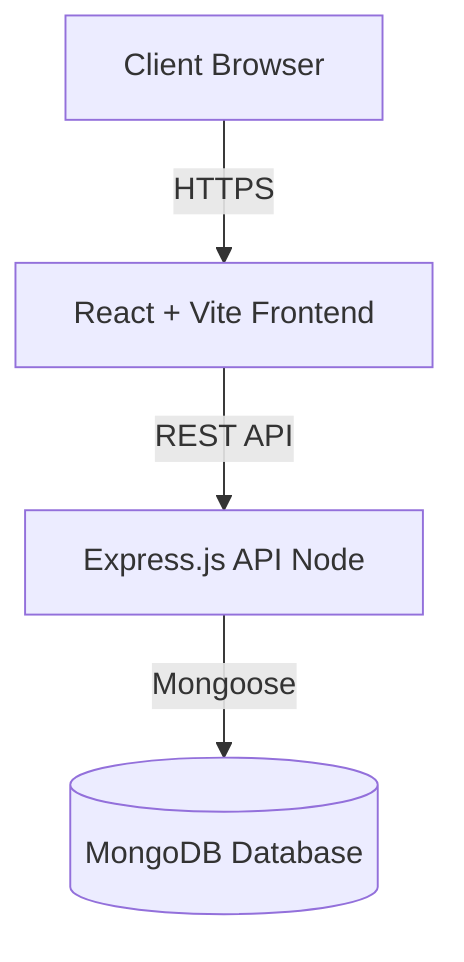

<div align="center">
  <!-- 2. Project Logo -->
  

  <!-- 1. Project Title -->
  <h1>Startup CRM Lite</h1>

  <p><em>A modern, lightweight Customer Relationship Management system tailored for startups and small businesses.</em></p>

  <!-- 3. Badges -->
  <p>
    
    
    
    
    
    
  </p>
</div>

---

## 4. Table of Contents

<details>
<summary>Click to expand</summary>

- [1. Project Title](#1-project-title)
- [2. Project Logo](#2-project-logo)
- [3. Badges](#3-badges)
- [4. Table of Contents](#4-table-of-contents)
- [5. Project Overview](#5-project-overview)
- [6. Problem Statement](#6-problem-statement)
- [7. Vision & Objectives](#7-vision--objectives)
- [8. Key Features](#8-key-features)
- [9. Target Users](#9-target-users)
- [10. Use Cases](#10-use-cases)
- [11. Business Value](#11-business-value)
- [12. Screenshots](#12-screenshots)
- [13. Complete System Architecture](#13-complete-system-architecture)
- [14. High-Level Architecture Overview](#14-high-level-architecture-overview)
- [15. Application Workflow](#15-application-workflow)
- [16. End-to-End User Flow](#16-end-to-end-user-flow)
- [17. Technology Stack](#17-technology-stack)
- [18. Project Folder Structure](#18-project-folder-structure)
- [19. Explanation of Every Major Folder](#19-explanation-of-every-major-folder)
- [20. Explanation of Every Important File](#20-explanation-of-every-important-file)
- [21. Frontend Architecture](#21-frontend-architecture)
- [22. Backend Architecture](#22-backend-architecture)
- [23. Database Architecture](#23-database-architecture)
- [24. API Overview](#24-api-overview)
- [25. Authentication & Authorization](#25-authentication--authorization)
- [26. State Management](#26-state-management)
- [27. Storage Strategy](#27-storage-strategy)
- [28. Third-Party Services & Integrations](#28-third-party-services--integrations)
- [29. AI/Automation Components](#29-aiautomation-components)
- [30. Development Prerequisites](#30-development-prerequisites)
- [31. Installation Guide](#31-installation-guide)
- [32. Environment Variables (.env) Documentation](#32-environment-variables-env-documentation)
- [33. Project Configuration](#33-project-configuration)
- [34. Running the Project (Development)](#34-running-the-project-development)
- [35. Running the Project (Production)](#35-running-the-project-production)
- [36. Build Process](#36-build-process)
- [37. Deployment Guide](#37-deployment-guide)
- [38. CI/CD Overview](#38-cicd-overview)
- [39. Testing Strategy](#39-testing-strategy)
- [40. Debugging Tips](#40-debugging-tips)
- [41. Logging & Monitoring](#41-logging--monitoring)
- [42. Security Considerations](#42-security-considerations)
- [43. Performance Optimizations](#43-performance-optimizations)
- [44. Coding Standards & Project Conventions](#44-coding-standards--project-conventions)
- [45. Versioning Strategy](#45-versioning-strategy)
- [46. Branching Strategy](#46-branching-strategy)
- [47. Contribution Guidelines](#47-contribution-guidelines)
- [48. Release Process](#48-release-process)
- [49. Known Limitations](#49-known-limitations)
- [50. Future Roadmap](#50-future-roadmap)
- [51. Frequently Asked Questions (FAQ)](#51-frequently-asked-questions-faq)
- [52. Troubleshooting Guide](#52-troubleshooting-guide)
- [53. Changelog](#53-changelog)
- [54. License](#54-license)
- [55. Credits & Acknowledgements](#55-credits--acknowledgements)
- [56. Contact Information](#56-contact-information)
- [57. Final Project Summary](#57-final-project-summary)

</details>

---

## 5. Project Overview

**Startup CRM Lite** is a fully functional, end-to-end Customer Relationship Management (CRM) application built specifically to address the needs of early-stage startups and small businesses. It provides a clean, modern, and highly responsive user interface for managing leads, tracking sales pipelines, and analyzing business growth without the bloat of traditional enterprise CRM software.

---

## 6. Problem Statement

Small businesses and startups often struggle with tracking potential clients and sales opportunities. Existing enterprise CRMs (like Salesforce or HubSpot) are frequently too expensive, too complex, and overloaded with features that small teams do not need. This leads to poor adoption rates, scattered data across spreadsheets, and ultimately, lost revenue.

---

## 7. Vision & Objectives

**Vision:** To democratize sales tracking by providing a lightning-fast, zero-learning-curve CRM that helps small teams close more deals.

**Objectives:**
1. Deliver a core set of lead management features.
2. Provide real-time analytics and forecasting capabilities.
3. Ensure high security and data isolation per user.
4. Maintain a lightweight footprint for both frontend and backend architectures.

---

## 8. Key Features

- **Lead Management:** Create, read, update, and delete (CRUD) leads.
- **Pipeline Tracking:** Transition leads through custom statuses (New, Contacted, Meeting Scheduled, Proposal Sent, Won, Lost).
- **Dashboard & Analytics:** Visual representations of sales pipelines, monthly stats, and forecast data.
- **Secure Authentication:** JWT-based authentication with secure password hashing (Bcrypt).
- **Dark/Light Mode:** First-class support for theming and visual accessibility.
- **Robust Security:** Built-in rate limiting, Helmet for secure HTTP headers, and MongoDB injection sanitization.

---

## 9. Target Users

1. **Founders/Solo Entrepreneurs:** Looking to move away from Excel or Notion for sales tracking.
2. **Small Sales Teams:** Needing a unified, centralized repository for active deals.
3. **Account Managers:** Tracking the lifecycle of clients from acquisition to closing.

---

## 10. Use Cases

- **Cold Outreach Tracking:** Sales reps log cold calls and emails as new leads and update their statuses when a meeting is booked.
- **Sales Forecasting:** Founders view the dashboard analytics to predict upcoming revenue based on leads currently in the "Proposal Sent" stage.
- **Lead Source Analysis:** Marketing teams analyze which acquisition channels (Website, Referral, LinkedIn) yield the highest conversion rates.

---

## 11. Business Value

- **Increased Conversion Rates:** By preventing leads from falling through the cracks.
- **Cost-Efficiency:** Eliminates the need for expensive per-seat enterprise CRM licenses.
- **Time Savings:** Streamlined UI reduces data entry friction, giving sales reps more time to sell.

---

## 12. Screenshots

| Dashboard View | Lead Management View |
|:---:|:---:|
|  |  |
| *Visual analytics and recent activity.* | *Kanban or list view of current sales pipeline.* |

*(Note: Replace placeholders with actual application screenshots).*

---

## 13. Complete System Architecture



---

## 14. High-Level Architecture Overview

Startup CRM Lite follows a standard decoupled **MERN stack** architecture (MongoDB, Express, React, Node.js).
1. **Presentation Layer:** A Single Page Application (SPA) built with React 19 and Vite. Uses Tailwind CSS for styling.
2. **Application Layer:** A Node.js/Express REST API that handles business logic, validation, and authentication.
3. **Data Layer:** A MongoDB database handling persistent data storage, accessed via Mongoose Object Data Modeling (ODM).

---

## 15. Application Workflow

1. **Initialization:** The React frontend loads and checks local storage for an active JWT.
2. **Authentication:** Unauthenticated users are routed to Login/Register pages.
3. **Data Fetching:** Upon successful login, the frontend Context API requests the user's leads from the Express API.
4. **State Hydration:** The API returns data, populating the LeadContext, which subsequently re-renders the Dashboard and Analytics components.
5. **Mutation:** When a user modifies a lead, an API request is fired. Upon success, the local Context state is updated optimistically or via re-fetch.

---

## 16. End-to-End User Flow

1. **User visits application.**
2. **Registers** a new account (or **Logs in**).
3. Land on the **Dashboard** to view aggregate pipeline metrics.
4. Navigates to **Leads Management**.
5. Clicks **"Add Lead"** and fills out lead data (Name, Company, Email, Source).
6. As the relationship progresses, the user updates the lead's **Status** (e.g., from "New" to "Meeting Scheduled").
7. User switches to **Dark Mode** via the navigation toggle for better nighttime viewing.
8. User securely **Logs Out**.

---

## 17. Technology Stack

### Frontend
- **Framework:** React 19
- **Build Tool:** Vite
- **Routing:** React Router DOM v7
- **Styling:** Tailwind CSS v4
- **Icons:** Lucide React
- **Charting:** Recharts
- **Notifications:** React Hot Toast
- **HTTP Client:** Axios

### Backend
- **Runtime:** Node.js
- **Framework:** Express.js v5
- **Authentication:** JSON Web Tokens (JWT) & BcryptJS
- **Validation:** Express Validator
- **Security:** Helmet, Express Rate Limit, Express Mongo Sanitize, CORS

### Database
- **DBMS:** MongoDB
- **ODM:** Mongoose v9

---

## 18. Project Folder Structure

```text
startup-crm-lite/
├── backend/                   # Express REST API
│   ├── config/                # Database configurations
│   ├── controllers/           # Business logic
│   ├── middleware/            # Auth, Validation, Error Handling
│   ├── models/                # Mongoose Database Schemas
│   ├── routes/                # API endpoint definitions
│   ├── utils/                 # Backend helpers
│   ├── package.json           # Backend dependencies
│   └── server.js              # Application entry point
├── src/                       # React Frontend
│   ├── assets/                # Static images, icons
│   ├── components/            # Reusable UI components
│   ├── constants/             # Enums and fixed configurations
│   ├── context/               # React Context providers (State)
│   ├── data/                  # Mock data or static datasets
│   ├── hooks/                 # Custom React hooks
│   ├── pages/                 # Full page views
│   ├── routes/                # Frontend routing configuration
│   ├── services/              # API call abstractions (Axios)
│   ├── utils/                 # Frontend helpers
│   ├── App.jsx                # Root React component
│   └── main.jsx               # React DOM rendering entry
├── dist/                      # Production build output
├── package.json               # Frontend dependencies & scripts
├── eslint.config.js           # Linter rules
├── vite.config.js             # Vite bundler configuration
└── vercel.json                # Vercel deployment configuration
```

---

## 19. Explanation of Every Major Folder

- `backend/controllers/`: Contains the core business logic. Extracts logic away from routes to keep code testable and clean.
- `backend/middleware/`: Security and validation layers that intercept requests before they hit controllers.
- `backend/models/`: Defines the structure of MongoDB documents and implements schema-level validation.
- `src/components/`: Modular React components grouped by feature (e.g., `analytics`, `dashboard`, `leads`).
- `src/context/`: Global state management holding user authentication data, lead data, and UI theme preferences.
- `src/pages/`: The top-level views of the application that orchestrate multiple components.

---

## 20. Explanation of Every Important File

- `backend/server.js`: The heart of the backend. Bootstraps Express, connects to MongoDB, applies security middlewares (Helmet, CORS, Rate Limiters), registers routes, and handles graceful shutdowns.
- `backend/models/User.js`: Defines the User schema, handles automatic password hashing via `bcrypt` pre-save hooks, and ensures secure JSON serialization (hiding passwords).
- `backend/models/Lead.js`: Defines the Lead schema with extensive indexing (text indexes for search, compound indexes for fast filtering) and virtual fields (like `age`).
- `src/App.jsx`: The layout wrapper for the frontend. Conditionally renders the Sidebar based on authentication state and wraps the app in necessary Providers.
- `src/services/api.js`: An Axios instance configured with base URLs and interceptors to automatically attach JWTs to outbound requests.

---

## 21. Frontend Architecture

The frontend follows a **Feature-Based** and **Context-Driven** architecture. 
Instead of relying on heavy state managers like Redux, it utilizes React's native `Context API` combined with custom hooks (`useAuth`, `useLead`, `useTheme`). UI components are purely presentational and subscribe to Contexts or Hooks for their data. Axios services handle network boundaries.

---

## 22. Backend Architecture

The backend utilizes an **MVC-like Layered Architecture** (Model-Route-Controller).
- **Routes Layer:** Defines endpoints and attaches validation/auth middlewares.
- **Controller Layer:** Executes business logic and database queries.
- **Model Layer:** Mongoose schemas that enforce data integrity.
Global error handling ensures that unexpected crashes or validation errors always return a uniform JSON structure to the client.

---

## 23. Database Architecture

**Database:** MongoDB.
**Collections:**
1. `users`: Stores authentication and profile data. Passwords are encrypted.
2. `leads`: Stores CRM data. Strongly tied to `users` via the `owner` field (ObjectId reference). This ensures multi-tenant data isolation—users can only query leads they own.

**Indexing Strategy:**
- Text indexes on `name`, `company`, and `email` for rapid autocomplete search.
- Compound indexes on `owner` + `status` for fast pipeline filtering.

---

## 24. API Overview

The backend exposes a RESTful API prefixed with `/api`.

**Auth Endpoints:**
- `POST /api/auth/register`: Create a new user.
- `POST /api/auth/login`: Authenticate and receive JWT.
- `GET /api/auth/me`: Validate token and retrieve user profile.

**Lead Endpoints:**
- `GET /api/leads`: Fetch all leads (paginated/filtered).
- `POST /api/leads`: Create a new lead.
- `GET /api/leads/stats/summary`: Fetch KPI dashboard metrics.
- `GET /api/leads/search?q=term`: Search leads.
- `PUT /api/leads/:id`: Fully update a lead.
- `PATCH /api/leads/:id/status`: Quickly update the pipeline status.
- `DELETE /api/leads/:id`: Remove a lead.

---

## 25. Authentication & Authorization

- **Authentication:** Handled via JSON Web Tokens (JWT). Upon login, the server signs a token containing the user's ID.
- **Authorization:** The `protect` middleware intercepts API requests, extracts the JWT from the `Authorization: Bearer <token>` header, verifies it using the `JWT_SECRET`, and attaches the verified user object to `req.user`.
- **Data Isolation:** All lead queries and mutations implicitly scope to `req.user._id` to prevent vertical/horizontal privilege escalation.

---

## 26. State Management

- **AuthContext:** Tracks the current JWT and user profile. Manages login/logout routines.
- **LeadContext:** Caches the list of leads. Provides functions to add, update, and delete leads, which automatically sync with the backend.
- **ThemeContext:** Tracks light/dark mode preference and persists it to `localStorage`.

---

## 27. Storage Strategy

- **Database:** MongoDB Atlas (Cloud) or local MongoDB instance for structured JSON documents.
- **Local Storage:** Browsers' `localStorage` is used exclusively for non-sensitive UI preferences (like Theme) and caching the JWT to survive page reloads.

---

## 28. Third-Party Services & Integrations

Currently, the application relies on standard ecosystem tools. No external APIs (like Stripe, SendGrid, or AWS S3) are currently integrated, keeping the architecture highly portable and independent.

---

## 29. AI/Automation Components

*(Not applicable in the current version of Startup CRM Lite)*.
Future iterations may include AI-based lead scoring or automated email generation.

---

## 30. Development Prerequisites

To run this project locally, you must have the following installed:
- **Node.js** (v18.x or v20.x recommended)
- **npm** (v9+ or equivalent)
- **MongoDB** (Local instance or MongoDB Atlas cluster)
- **Git**

---

## 31. Installation Guide

1. **Clone the repository:**
   ```bash
   git clone https://github.com/your-org/startup-crm-lite.git
   cd startup-crm-lite
   ```

2. **Install Frontend Dependencies:**
   ```bash
   npm install
   ```

3. **Install Backend Dependencies:**
   ```bash
   cd backend
   npm install
   cd ..
   ```

---

## 32. Environment Variables (.env) Documentation

You need two `.env` files.

**1. Backend Environment Variables (`backend/.env`):**
```env
# Server Configuration
PORT=5000
NODE_ENV=development

# Database
MONGODB_URI=mongodb://127.0.0.1:27017/startup-crm

# Security
JWT_SECRET=your_super_secret_jwt_key_here
JWT_EXPIRE=30d

# CORS (Required for production, optional for dev)
FRONTEND_URL=http://localhost:5173
```

**2. Frontend Environment Variables (`.env` in project root):**
```env
VITE_API_URL=http://localhost:5000/api
```

---

## 33. Project Configuration

- **Vite (`vite.config.js`):** Configured with `@vitejs/plugin-react` and TailwindCSS plugins.
- **ESLint (`eslint.config.js`):** Configured with modern React hooks rules and Vite environment globals.
- **Tailwind (`index.css`):** Utilizes Tailwind v4 concepts and imports.

---

## 34. Running the Project (Development)

To run the application locally, you need to start both the frontend and backend servers.

**Terminal 1 (Backend):**
```bash
cd backend
npm run dev
```
*(Runs on `http://localhost:5000` via nodemon)*

**Terminal 2 (Frontend):**
```bash
npm run dev
```
*(Runs on `http://localhost:5173` via Vite)*

---

## 35. Running the Project (Production)

To simulate a production environment locally:

```bash
# 1. Build the frontend
npm run build

# 2. Start the backend in production mode
cd backend
NODE_ENV=production node server.js
```
*(Note: You will need to serve the static `dist/` folder via Express or a web server like Nginx).*

---

## 36. Build Process

The frontend is bundled using Vite and ESBuild.
```bash
npm run build
```
This generates a highly optimized, minified `dist/` directory containing standard HTML, CSS, and JS assets ready for deployment to any static hosting provider.

---

## 37. Deployment Guide

**Frontend (Vercel / Netlify):**
1. Connect your GitHub repository to Vercel.
2. Build Command: `npm run build`
3. Output Directory: `dist`
4. Ensure `vercel.json` is present to handle SPA routing (rewriting all requests to `index.html`).

**Backend (Render / Railway / Heroku):**
1. Connect your GitHub repository.
2. Set Root Directory to `backend/` (if supported) or customize the start command to `node backend/server.js`.
3. Add all production environment variables (MongoDB URI, JWT Secret).

---

## 38. CI/CD Overview

Currently, the project is structured to deploy automatically upon push to the `main` branch when connected to modern PaaS platforms like Vercel and Render. Future enhancements will introduce GitHub Actions for automated linting and testing prior to deployment.

---

## 39. Testing Strategy

Currently, manual testing is utilized.
**Future Implementation:**
- **Unit Testing:** Jest and React Testing Library for frontend components.
- **Integration Testing:** Supertest and Mocha/Chai for backend API endpoints.

---

## 40. Debugging Tips

- **CORS Errors:** Ensure the `FRONTEND_URL` environment variable in the backend `.env` perfectly matches the URL of your frontend (without trailing slashes).
- **MongoDB Connection:** Ensure your IP address is whitelisted in MongoDB Atlas if using a cloud database.
- **Missing Data:** Verify the `Authorization` header is being attached properly in `src/services/api.js`.

---

## 41. Logging & Monitoring

- **Development:** `morgan` middleware logs all API requests to the console in a colorful, concise format.
- **Production:** `morgan` switches to the Apache `combined` format, suitable for ingestion by Datadog, Splunk, or AWS CloudWatch.

---

## 42. Security Considerations

- **XSS Protection:** React natively escapes variables. `Helmet` sets strict HTTP headers.
- **CSRF Protection:** Handled inherently by relying on stateless JWTs stored in memory or `localStorage` rather than HTTP-only cookies (though moving to HTTP-only cookies is a valid future enhancement).
- **NoSQL Injection:** `express-mongo-sanitize` actively strips `$` and `.` characters from request bodies.
- **Rate Limiting:** Aggressive rate limiting on `/api/auth` endpoints prevents credential stuffing attacks.

---

## 43. Performance Optimizations

- **Vite Bundler:** Extremely fast HMR during development and tree-shaking during production builds.
- **Database Indexing:** MongoDB queries utilize compound and text indexes to ensure O(1) or O(log N) query times.
- **Payload Limits:** Express restricts incoming JSON payloads to `10kb` to prevent memory bloat from malicious large payloads.

---

## 44. Coding Standards & Project Conventions

- **Frontend:** Functional components, React Hooks, ES6+ syntax.
- **Backend:** ES Modules (`type: "module"` in `package.json`), asynchronous controllers (`async/await`), early return patterns.
- **Formatting:** ESLint strictly enforces code styling.

---

## 45. Versioning Strategy

We follow [Semantic Versioning](https://semver.org/) (SemVer).
- `MAJOR` version when making incompatible API changes.
- `MINOR` version when adding functionality in a backward compatible manner.
- `PATCH` version when making backward compatible bug fixes.

---

## 46. Branching Strategy

- `main`: Production-ready, stable code.
- `develop`: Pre-production code, actively integrated.
- `feature/*`: New features (e.g., `feature/analytics-dashboard`).
- `bugfix/*`: Bug resolutions (e.g., `bugfix/cors-issue`).

---

## 47. Contribution Guidelines

1. Fork the repository.
2. Create your Feature Branch (`git checkout -b feature/AmazingFeature`).
3. Commit your Changes (`git commit -m 'Add some AmazingFeature'`).
4. Push to the Branch (`git push origin feature/AmazingFeature`).
5. Open a Pull Request.

Please ensure all ESLint rules pass before submitting a PR.

---

## 48. Release Process

1. Merge approved features into `develop`.
2. Perform QA/Staging testing on `develop`.
3. Create a Release PR from `develop` to `main`.
4. Tag the commit with the new version number (e.g., `v1.0.1`).
5. Vercel/Render will auto-deploy the `main` branch.

---

## 49. Known Limitations

- Real-time updates (WebSockets) are not currently implemented; data updates require a page refresh or context re-fetch.
- No role-based access control (RBAC) UI implementations yet, though the schema supports 'admin' vs 'user'.

---

## 50. Future Roadmap

- **Q3:** Implement WebSockets for real-time collaboration.
- **Q3:** Add CSV export and import functionality for leads.
- **Q4:** Integrate email providers (SendGrid/Mailgun) to track correspondence directly within the CRM.
- **Q4:** Comprehensive Unit and E2E testing suite implementation.

---

## 51. Frequently Asked Questions (FAQ)

**Q: Can I use PostgreSQL instead of MongoDB?**
A: Not directly. The backend uses Mongoose, which is strictly for MongoDB. Switching to SQL would require swapping Mongoose for an ORM like Prisma or Sequelize and rewriting the controllers.

**Q: Why use Context API instead of Redux?**
A: To keep the application lightweight. The state complexity of this app does not currently warrant the boilerplate of Redux.

---

## 52. Troubleshooting Guide

**Error:** `MongoTimeoutError: Server selection timed out after 30000 ms`
**Solution:** Check your `.env` file to ensure `MONGODB_URI` is correct. If using Atlas, ensure your current IP address is added to the Network Access Allowlist.

**Error:** `CORS: Origin not allowed`
**Solution:** Ensure your frontend URL is listed in the `allowedOrigins` array in `backend/server.js` or provided via the `FRONTEND_URL` environment variable.

---

## 53. Changelog

### [1.0.0] - Initial Release
- Implemented JWT Authentication.
- Built CRUD operations for Lead Management.
- Created interactive Dashboard with Recharts.
- Added Dark/Light Mode support.
- Secured API with Helmet, Rate Limiting, and Mongo Sanitize.

---

## 54. License

This project is licensed under the **ISC License**.
*(See the [package.json](package.json) file for details).*

---

## 55. Credits & Acknowledgements

- React and Vite communities for excellent frontend tooling.
- Express.js and MongoDB for reliable backend architecture.
- TailwindCSS for making styling a breeze.

---

## 56. Contact Information

For support, architectural questions, or contribution inquiries, please reach out via GitHub Issues on the repository.

---

## 57. Final Project Summary

**Startup CRM Lite** represents a meticulously architected, modern web application designed for performance, security, and developer ergonomics. By strictly decoupling the frontend and backend, enforcing high security standards, and maintaining a clean visual aesthetic, it serves as both a production-ready application and an exemplary boilerplate for full-stack JavaScript development.
